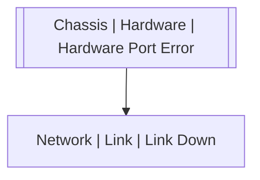

# Chassis | Hardware | Hardware Port Error

## Symptoms

Link becomes unstable or is not responding

## Probable Causes

## Recommended Actions

## Variables

Variable | Description | Default
--- | --- | ---
interface | Hardware port | `:material-close:`

## Alarm Correlation

Scheme of correlation of `Chassis | Hardware | Hardware Port Error` alarms with other alarms is on the chart. 
Arrows are directed from root cause to consequences.

### Root Causes
`Chassis | Hardware | Hardware Port Error` alarm may be root cause of

Alarm Class | Description
--- | ---
`Network | Link | Link Down` | Hardware Port Error

## Events

### Opening Events
`Chassis | Hardware | Hardware Port Error` may be raised by events

Event Class | Description
--- | ---
`Chassis | Hardware | Hardware Port Error` | dispose

### Closing Events
`Chassis | Hardware | Hardware Port Error` may be cleared by events

Event Class | Description
--- | ---
`Chassis | Hardware | Hardware Port Error Recover` | dispose
