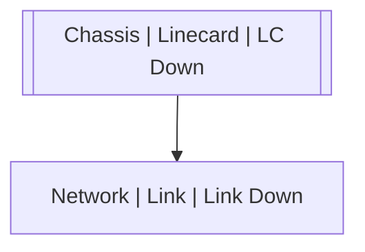

# Chassis | Linecard | LC Down

## Symptoms

## Probable Causes

## Recommended Actions

## Variables

Variable | Description | Default
--- | --- | ---
number | Slot number | `:material-close:`
reason | Reason | `:material-close:`

## Alarm Correlation

Scheme of correlation of `Chassis | Linecard | LC Down` alarms with other alarms is on the chart. 
Arrows are directed from root cause to consequences.

### Root Causes
`Chassis | Linecard | LC Down` alarm may be root cause of

Alarm Class | Description
--- | ---
`Network | Link | Link Down` | Linecard Down

## Events

### Opening Events
`Chassis | Linecard | LC Down` may be raised by events

Event Class | Description
--- | ---
`Chassis | Linecard | LC Down` | dispose

### Closing Events
`Chassis | Linecard | LC Down` may be cleared by events

Event Class | Description
--- | ---
`Chassis | Linecard | LC Up` | dispose
