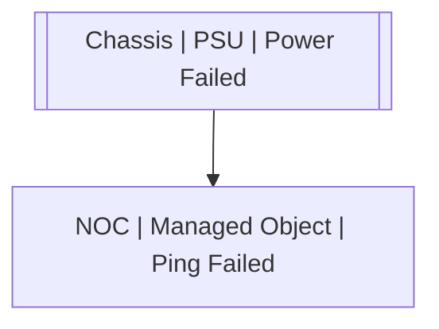

# Chassis | PSU | Power Failed

## Symptoms

## Probable Causes

## Recommended Actions

## Variables

Variable | Description | Default
--- | --- | ---
condition | Condition | `:material-close:`

## Alarm Correlation

Scheme of correlation of `Chassis | PSU | Power Failed` alarms with other alarms is on the chart. 
Arrows are directed from root cause to consequences.

### Root Causes
`Chassis | PSU | Power Failed` alarm may be root cause of

Alarm Class | Description
--- | ---
`NOC | Managed Object | Ping Failed` | Power Failed

## Events

### Opening Events
`Chassis | PSU | Power Failed` may be raised by events

Event Class | Description
--- | ---
`Chassis | PSU | Power Failed` | dispose

### Closing Events
`Chassis | PSU | Power Failed` may be cleared by events

Event Class | Description
--- | ---
`NOC | Managed Object | Ping OK` | dispose
