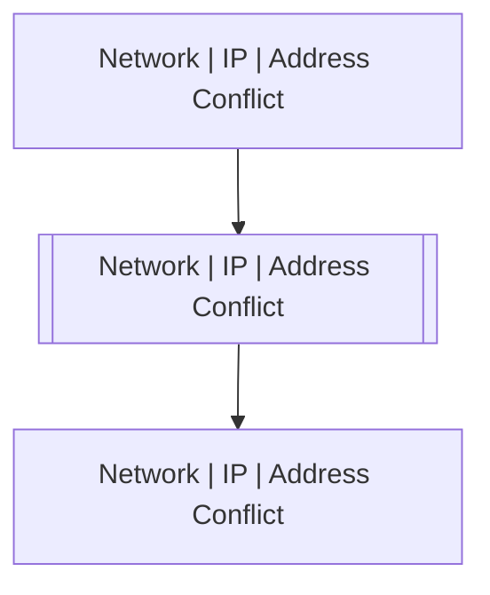

# Network | IP | Address Conflict

## Symptoms

## Probable Causes

## Recommended Actions

## Variables

Variable | Description | Default
--- | --- | ---
ip | Conflicting IP | `:material-close:`
mac | MAC | `:material-close:`
interface | Interface | `:material-close:`

## Alarm Correlation

Scheme of correlation of `Network | IP | Address Conflict` alarms with other alarms is on the chart. 
Arrows are directed from root cause to consequences.

### Root Causes
`Network | IP | Address Conflict` alarm may be consequence of

Alarm Class | Description
--- | ---
`Network | IP | Address Conflict` | Address Conflict

### Root Causes
`Network | IP | Address Conflict` alarm may be root cause of

Alarm Class | Description
--- | ---
`Network | IP | Address Conflict` | Address Conflict

## Events

### Opening Events
`Network | IP | Address Conflict` may be raised by events

Event Class | Description
--- | ---
`Network | IP | Address Conflict` | dispose
