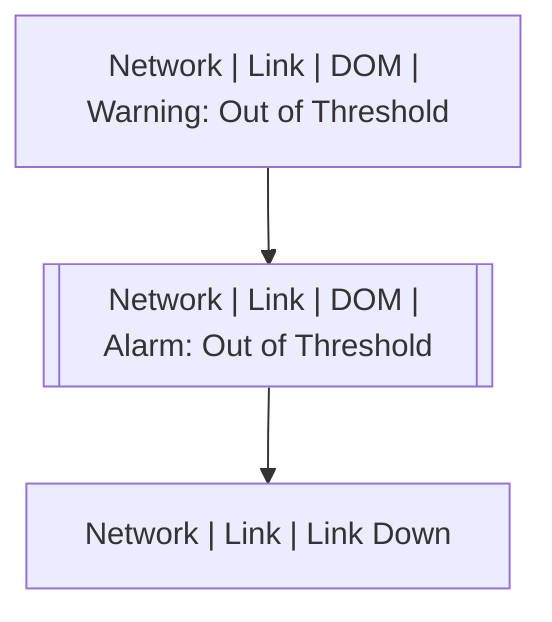

# Network | Link | DOM | Alarm: Out of Threshold

## Symptoms

Connection lost

## Probable Causes

## Recommended Actions

## Variables

Variable | Description | Default
--- | --- | ---
interface | Physical port | `:material-close:`
threshold | Threshold type | `:material-close:`
sensor | Measured name | `:material-close:`
ovalue | Operating value | `:material-close:`
tvalue | Threshold value | `:material-close:`
description | Interface description | `=InterfaceDS.description`

## Alarm Correlation

Scheme of correlation of `Network | Link | DOM | Alarm: Out of Threshold` alarms with other alarms is on the chart. 
Arrows are directed from root cause to consequences.

### Root Causes
`Network | Link | DOM | Alarm: Out of Threshold` alarm may be consequence of

Alarm Class | Description
--- | ---
`Network | Link | DOM | Warning: Out of Threshold` | Warning: Out of Threshold

### Root Causes
`Network | Link | DOM | Alarm: Out of Threshold` alarm may be root cause of

Alarm Class | Description
--- | ---
`Network | Link | Link Down` | DOM Out of Threshold

## Events

### Opening Events
`Network | Link | DOM | Alarm: Out of Threshold` may be raised by events

Event Class | Description
--- | ---
`Network | Link | DOM | Alarm: Out of Threshold` | dispose

### Closing Events
`Network | Link | DOM | Alarm: Out of Threshold` may be cleared by events

Event Class | Description
--- | ---
`Network | Link | DOM | Alarm: Out of Threshold Recovered` | dispose
