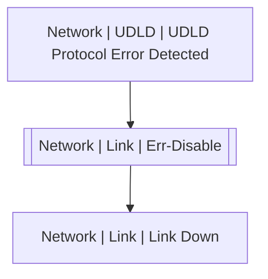

# Network | Link | Err-Disable

## Symptoms

## Probable Causes

## Recommended Actions

## Variables

Variable | Description | Default
--- | --- | ---
interface | interface name | `:material-close:`
reason | err-disable reason | `:material-close:`
description | Interface description | `=InterfaceDS.description`

## Alarm Correlation

Scheme of correlation of `Network | Link | Err-Disable` alarms with other alarms is on the chart. 
Arrows are directed from root cause to consequences.

### Root Causes
`Network | Link | Err-Disable` alarm may be consequence of

Alarm Class | Description
--- | ---
`Network | UDLD | UDLD Protocol Error Detected` | UDLD

### Root Causes
`Network | Link | Err-Disable` alarm may be root cause of

Alarm Class | Description
--- | ---
`Network | Link | Link Down` | err-disable

## Events

### Opening Events
`Network | Link | Err-Disable` may be raised by events

Event Class | Description
--- | ---
`Network | Link | Err-Disable` | dispose
`Network | Link | Link Flap Error Detected` | dispose

### Closing Events
`Network | Link | Err-Disable` may be cleared by events

Event Class | Description
--- | ---
`Network | Link | Link Flap Error Recovery` | dispose
`Network | Link | Link Up` | Clear Err-Disable
