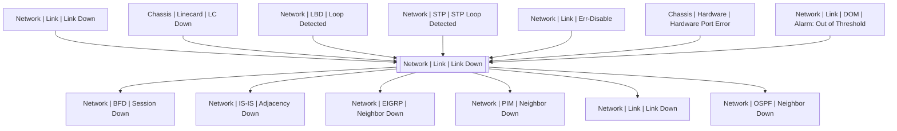

# Network | Link | Link Down

## Symptoms

Connection lost

## Probable Causes

Administrative action, cable damage, hardware or software error either from this or from another side

## Recommended Actions

Check configuration, both sides of links and hardware

## Variables

Variable | Description | Default
--- | --- | ---
interface | interface name | `:material-close:`
description | Interface description | `=InterfaceDS.description`
link | Link ID | `=InterfaceDS.link`

## Alarm Correlation

Scheme of correlation of `Network | Link | Link Down` alarms with other alarms is on the chart. 
Arrows are directed from root cause to consequences.

### Root Causes
`Network | Link | Link Down` alarm may be consequence of

Alarm Class | Description
--- | ---
`Network | Link | Link Down` | Other side link down
`Chassis | Linecard | LC Down` | Linecard Down
`Network | LBD | Loop Detected` | LBD Loop
`Network | STP | STP Loop Detected` | STP Loop Detected
`Network | Link | Err-Disable` | err-disable
`Chassis | Hardware | Hardware Port Error` | Hardware Port Error
`Network | Link | DOM | Alarm: Out of Threshold` | DOM Out of Threshold

### Root Causes
`Network | Link | Link Down` alarm may be root cause of

Alarm Class | Description
--- | ---
`Network | BFD | Session Down` | Link Down
`Network | IS-IS | Adjacency Down` | Link Down
`Network | EIGRP | Neighbor Down` | Link Down
`Network | PIM | Neighbor Down` | Link Down
`Network | Link | Link Down` | Other side link down
`Network | OSPF | Neighbor Down` | Link Down

## Events

### Opening Events
`Network | Link | Link Down` may be raised by events

Event Class | Description
--- | ---
`Network | Link | Link Down` | dispose

### Closing Events
`Network | Link | Link Down` may be cleared by events

Event Class | Description
--- | ---
`Network | Link | Link Up` | Clear Link Down
