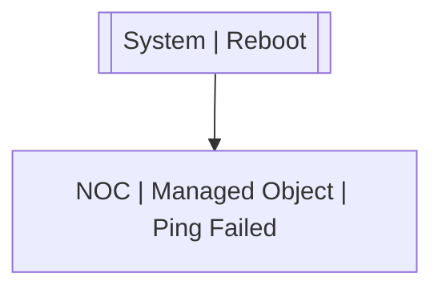

# System | Reboot

## Symptoms

## Probable Causes

## Recommended Actions

## Alarm Correlation

Scheme of correlation of `System | Reboot` alarms with other alarms is on the chart. 
Arrows are directed from root cause to consequences.

### Root Causes
`System | Reboot` alarm may be root cause of

Alarm Class | Description
--- | ---
`NOC | Managed Object | Ping Failed` | System Reboot

## Events

### Opening Events
`System | Reboot` may be raised by events

Event Class | Description
--- | ---
`System | Reboot` | dispose

### Closing Events
`System | Reboot` may be cleared by events

Event Class | Description
--- | ---
`System | Started` | dispose
