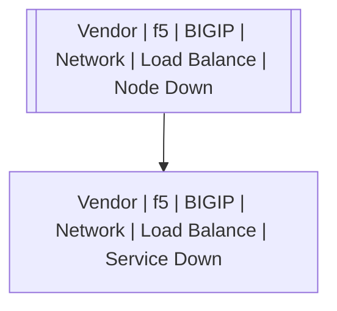

# Vendor | f5 | BIGIP | Network | Load Balance | Node Down

## Symptoms

## Probable Causes

## Recommended Actions

## Variables

Variable | Description | Default
--- | --- | ---
node | IP or hostname | `:material-close:`

## Alarm Correlation

Scheme of correlation of `Vendor | f5 | BIGIP | Network | Load Balance | Node Down` alarms with other alarms is on the chart. 
Arrows are directed from root cause to consequences.

### Root Causes
`Vendor | f5 | BIGIP | Network | Load Balance | Node Down` alarm may be root cause of

Alarm Class | Description
--- | ---
`Vendor | f5 | BIGIP | Network | Load Balance | Service Down` | Node down

## Events

### Opening Events
`Vendor | f5 | BIGIP | Network | Load Balance | Node Down` may be raised by events

Event Class | Description
--- | ---
`Vendor | f5 | BIGIP | Network | Load Balance | Node Down` | dispose

### Closing Events
`Vendor | f5 | BIGIP | Network | Load Balance | Node Down` may be cleared by events

Event Class | Description
--- | ---
`Vendor | f5 | BIGIP | Network | Load Balance | Node Up` | dispose
