# Administrative Domain

_Administrative Domain_ is a part of administrative division of
_Managed Object_. It answers to the question: "Who is responsible for
Managed Object?". Another synonym for _Administrative Domain_ is
_Area of Responsibility_.

_Administrative Domains_ are hierarchical by nature. Management
functions may be delegated to underlying branches. Consider example:

Group _West_ delegates management function to branches _Branch1_ and _Branch2_
while group _East_ - to _Branch3_ and _Branch4_ accordingly. Note
that _East_ and _West_ is not obliged to delegate all their objects
to underlying branches. Some of objects may remain on direct _East_ and _West_
maintenance

## Managed Object Access

NOC limits access to _Managed Objects_ on per-administrative domain basis.
:doc:`/reference/user` or :doc:`/reference/group` may be granted to
zero-or-more _Administrative Domains_. Granting access to _Administrative Domain_
means that :doc:`/reference/user` gets access to Managed Objects of
_Administrative Domain_ and all of its descendants.

Access Limiting means :doc:`/reference/user` will get access to
appropriate _Managed Objects_, their _Cards_, _Configs_, _Alarms_ and _Reports_.

Consider example:

Granting access to _West_ automatically grants access to _Branch1_ and _Branch2_
as well.

## Best Practices

Though you mileage may vary, consider several common practices

### Single Administrative Domain

Single administrative domain is good start for small installation
where all management functions carried by single department

### Functional Division

If network is maintained by several functional departments, they are
may be represented as _Administrative Domains_. Such scheme considers
_IT_ need no knowledge about _Transport_ and vise-versa

### Regional Division

_Administrative Domain_ reflects organizational branch structure. Regional
branches are responsible for their parts of network, while their head
branches fully remains control over branches and own infrastructures.

Sometimes top-level _Administrative Domain_ makes sense if head office
has own infrastructure and wish to remain control on over all network.

If HQ has own infrastructure but not controls all network following scheme
is possible

You always has option to grant access to _HQ_ and _West_ and _East_ to user
when necessary

### Regional-Functional division

Following scheme considers each regional branch has separate divisions
for parts of their networks

### Functional-Regional Division

Following scheme differs from previous in fact that appropriate regional
structural departments are managed by appropriate structural departments,
not by regional branches

